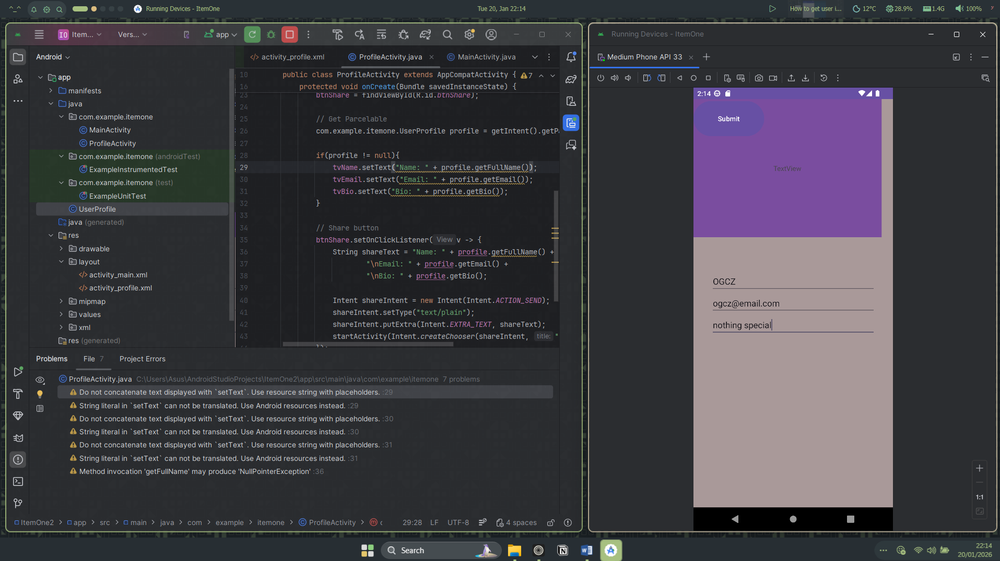
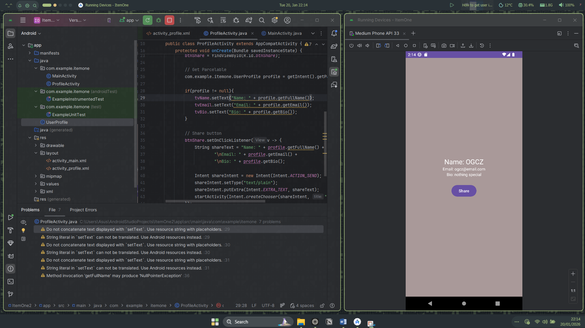
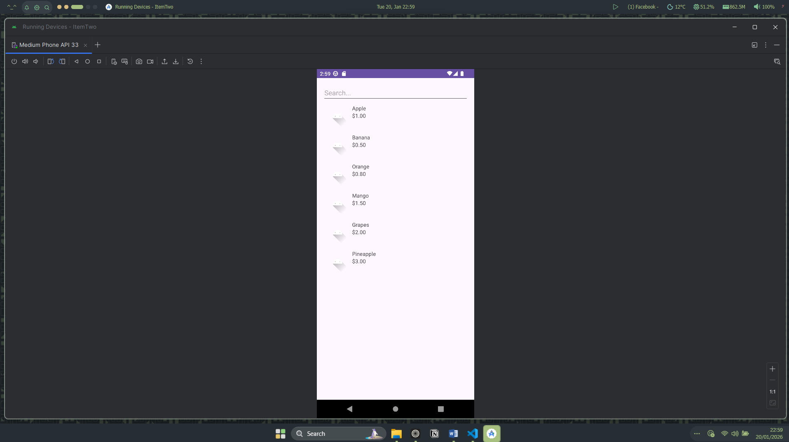
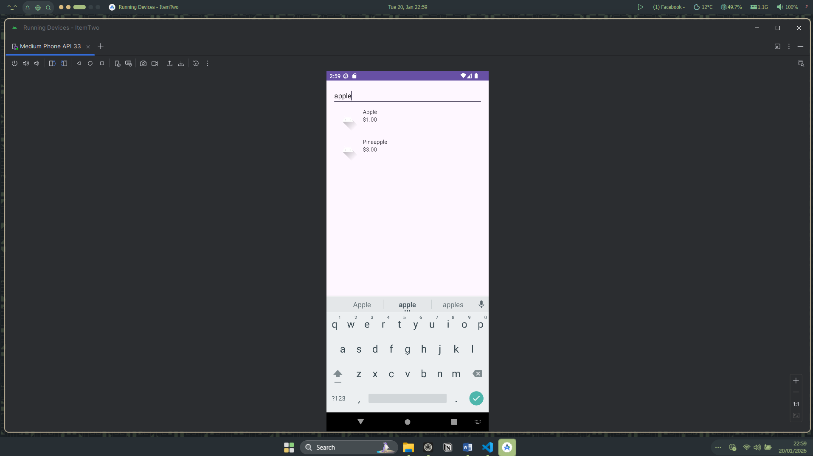
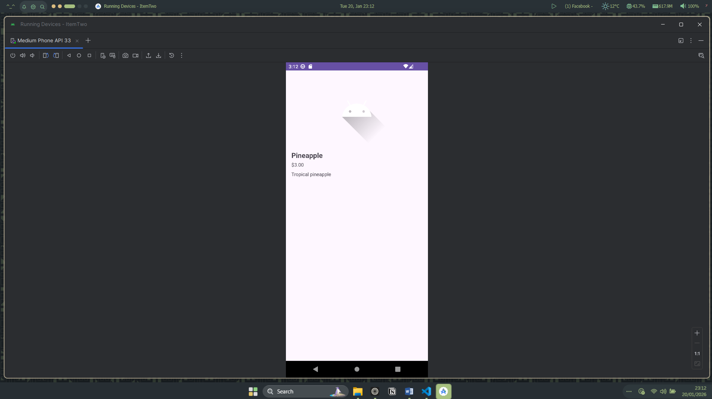
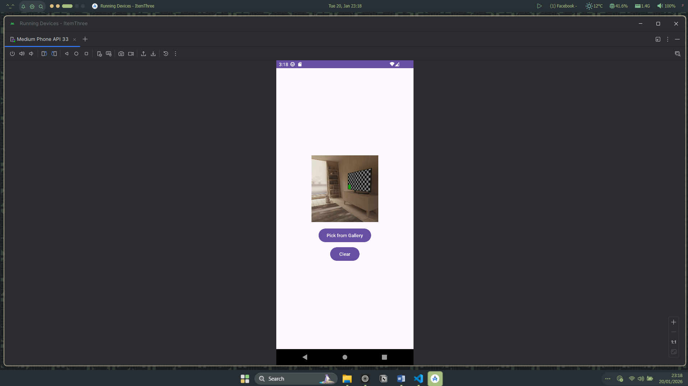
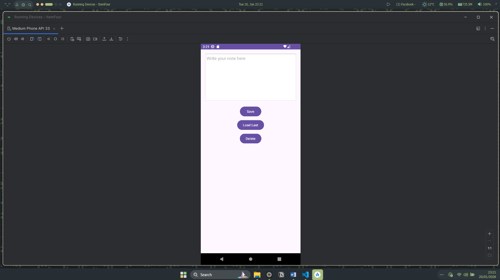
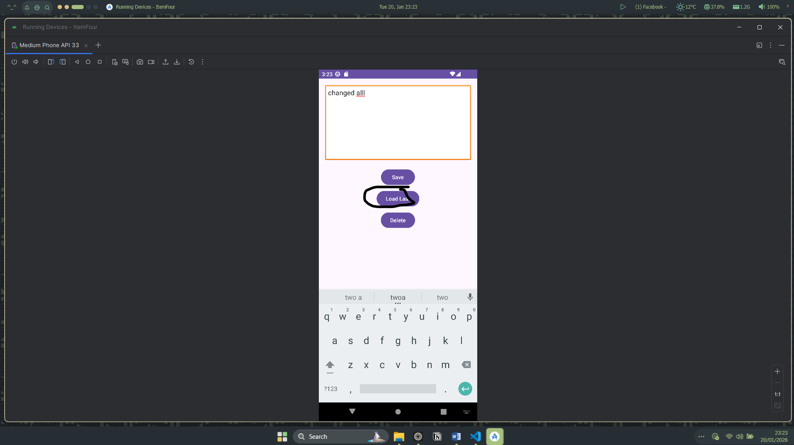

# CTAPDEVL 

This serves as my public repository on my class Applications Development & Emerging Technologies 

### Project Prequisites
- Java
- API 24 ("Nougat"; Android 7.0) 
- Kotlin DSL 
- Device Medium Phone (Android 13.0 Tiramisu)

### Item One

### Item Two

### Item Two

### Item Four

